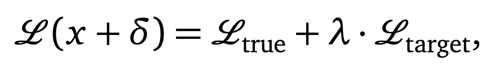

# Adversarial Attacks on Watermarks

## Overview

### Introduction
With the rise of Generative AI, protecting digital media authenticity has become increasingly crucial. Invisible watermarking is a viable solution, preserving image quality while preventing unauthorized alterations. However, attacks like Gaussian blur, noise, cropping, and AI-driven regeneration methods—such as the Stable Diffusion Watermark Removal Attack—can effectively remove these watermarks, leading to issues like misinformation.

In this project, we explore a novel watermarking approach designed to withstand regeneration attacks. Our method leverages adversarial perturbations using the Projected Gradient Descent (PGD) attack, which subtly modifies images in ways that disrupt AI models while maintaining human imperceptibility. Unlike prior research that focuses on defending against adversarial attacks, we utilize them to create a watermark that remains resilient against AI-based modifications.

By integrating adversarial perturbations, our watermarking technique makes it more challenging for generative models to remove or ignore embedded signals, ensuring ownership verification even after AI alterations. We use the ImageNet dataset and the ResNet50 model to develop and evaluate our approach, testing its robustness on a validation set of 1,000 images.

### Methods

#### PGD Attack
The Projected Gradient Descent (PGD) attack is a widely used adversarial attack that iteratively perturbs an input sample to maximize the loss of a deep learning model while keeping the perturbation within a specified norm constraint. This method extends the Fast Gradient Sign Method (FGSM) by applying multiple iterative updates with projection to ensure that the perturbation remains within a bounded region. We use this attack as the base of our watermark. 

#### Whitebox Attack
Our whitebox watermarking approach applies the PGD attack as a base, but with a novel twist. We select a random subset of k labels and aim to increase the logit scores (model's predicted probability) for these labels. The watermark subtly alters the image such that the model's output probabilities for specific target classes are significantly affected, while maintaining the overall visual appearance.

The watermark is applied as an adversarial perturbation δ to the original image x, generated using a targeted adversarial attack to maximize the model's confidence in a set of target classes while keeping the primary classification stable.

Given a pre-trained classifier f(·), an input image x, a true class label ytrue, and a set of target class labels T, our objective function is:

<figure>
  
  <figcaption>Figure 1: Equation for adversarial objective function.</figcaption>
</figure>

<figure>
  
  <figcaption>Figure 2: Equation representing loss function balancing true class and target labels.</figcaption>
</figure>

#### Blackbox Attack
In our black-box watermarking approach, we introduce a perturbation that alters the model's output probabilities for a randomly selected subset of k labels without direct access to the model's gradients. This method relies on an iterative query-based optimization process.

Since we don't have access to the model's internal gradients, we:
1. Select k target labels at random.
2. Query the model with the original image to obtain baseline logits.
3. Update the perturbation to maximize the probability of target labels.
4. Scale the perturbation to account for multiple target labels.

#### Watermark Verification
For both approaches, we verify the watermark by setting a percentage threshold for the amount of target labels' logit scores that were raised. If a certain percentage of target labels' logit scores increase, we consider the image watermarked.

<figure>
  
  <figcaption>Figure 3: Equation defining watermark verification criteria.</figcaption>
</figure>

For consistency in our experiments, we used k = 4 with secret labels: plane, cardigan, barrow, and Sealyham Terrier. We set ε = 3.5/255 for white-box and ε = 0.7/255 for black-box approaches, with a verification threshold of 50%.

### Results

Our watermarking techniques successfully increased the logit scores of target labels while maintaining the visual integrity of the images. The key findings include:

1. **Logit Distribution Analysis**  
   Both white-box and black-box approaches showed increased logit scores for secret labels after watermarking, while the overall distribution remained stable.  

   <figure>
     
     <figcaption>Figure 1: Logit distribution for the white-box approach.</figcaption>
   </figure>

   <figure>
     
     <figcaption>Figure 2: Logit distribution for the black-box approach.</figcaption>
   </figure>

   <figure>
     
     <figcaption>Figure 3: Overall logit distribution for the white-box approach.</figcaption>
   </figure>

   <figure>
     
     <figcaption>Figure 4: Overall logit distribution for the black-box approach.</figcaption>
   </figure>

2. **ROC Curve Analysis**  
   Target labels showed high AUC values, indicating excellent model performance in distinguishing these classes. For example, the Sealyham Terrier class achieved an AUC of 0.93, demonstrating the model’s ability to reliably detect the watermarked labels.  

   <figure>
     
     <figcaption>Figure 5: ROC curve for the white-box approach.</figcaption>
   </figure>

   <figure>
     
     <figcaption>Figure 6: ROC curve for the black-box approach.</figcaption>
   </figure>

3. **Visual Quality**  
   By selecting appropriate epsilon values, we ensured that perturbations remained subtle, preserving image appearance while effectively raising logit scores.  

   **White-box Approach - Before and After Watermarking:**  

   <figure>
     
     <figcaption>Figure 7: Comparison of preprocessing, perturbation noise, and the final watermarked image in the white-box approach.</figcaption>
   </figure>

   **Black-box Approach - Before and After Watermarking:**  

   <figure>
     
     <figcaption>Figure 8: Comparison of preprocessing, perturbation noise, and the final watermarked image in the black-box approach.</figcaption>
   </figure>

4. **Resistance to Attacks**  
   When subjected to the Stable Diffusion Regenerative Attack at various noise steps (0, 20, 40, 80, 160), our watermarked images remained verifiable. However, visual quality degraded at higher noise steps.  

   <figure>
     
     <figcaption>Figure 9: White-box watermarked image under different noise steps.</figcaption>
   </figure>

   <figure>
     
     <figcaption>Figure 10: Black-box watermarked image under different noise steps.</figcaption>
   </figure>

5. **Performance Comparison**  
   There was no substantial difference in effectiveness between the white-box and black-box approaches. However, the white-box method offered more tunable parameters for experimentation.  

   For optimal performance, we determined that our watermark works best with fewer target labels (lower k) and at specific epsilon values that balance imperceptibility with watermark strength.

### Conclusion

Our PGD-based watermarking method demonstrated effectiveness against regeneration attacks, with performance varying based on image characteristics and target label selection. The approach provides a viable defense mechanism against sophisticated watermark removal techniques, particularly regeneration attacks that typically defeat conventional watermarking methods.

This work lays a foundation for future advancements in watermark-based security measures to protect digital content authenticity in an era of increasingly powerful generative AI. By turning adversarial perturbations from a vulnerability into a security feature, we offer a novel perspective on digital media protection.

### References

- Kurakin, A., Goodfellow, I., & Bengio, S. (2016). "Adversarial machine learning at scale." arXiv preprint arXiv:1611.01236  
- Madry, A., Makelov, A., Schmidt, L., Tsipras, D., & Vladu, A. (2017). "Towards deep learning models resistant to adversarial attacks." arXiv preprint arXiv:1706.06083  
- Zhao, X., et al. (2024). "Invisible Image Watermarks Are Provably Removable Using Generative AI." Cryptography and Security.  

### About Us  
**Andy Truong**  
amt007@ucsd.edu  

**Anushka Purohit**  
apurohit@ucsd.edu  

**Mentor: Yu-Xiang Wang**  
yuxiangw@ucsd.edu  
